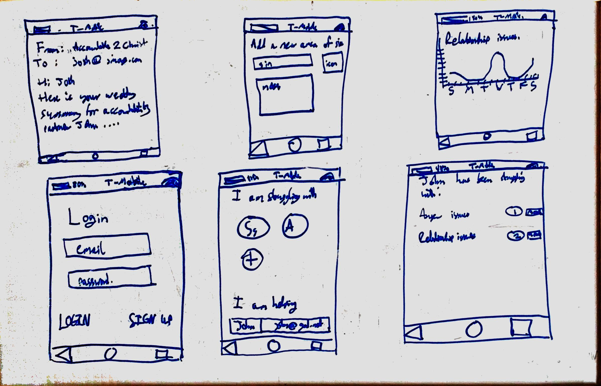

# accountable2christ
Accountability software to help Christians easily share their weekly struggles with their accountability partners

## Planning

### Trello
Trello is used for planning, the link to the board is [here](https://trello.com/b/m69twmED/accountable2christ).

### Mockups

### Languages and libraries

Component|Language / framework
---|---
Mobile App | [Cordova](https://cordova.apache.org/)
Web App | Custom client-side JS ?
Web Server | [Node.js](https://node.js)
DBMS | MariaDB / PostgreSQL
Email Server (SMTP) | ?
